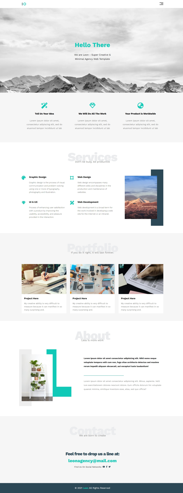

# HTML-CSS-Template-1

A simple responsive HTML and CSS template for building a modern website.

## Demo

You can view a live demo of this template [here](https://hananeaitbenyachou.github.io/HTML-CSS-Template-1/).

## Screenshot

## Description

This repository contains a basic HTML and CSS template that can be used as a starting point for your web projects. The template is designed to be simple yet functional, providing a foundation for building responsive and aesthetically pleasing websites.

## Features

- Simple and clean design
- Responsive layout
- Easy to customize
- Includes basic CSS styling
- Compatible with all modern browsers
